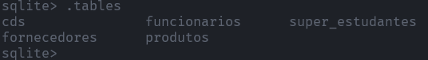

<details><summary><b>Lista 01</b></summary>

- 01 - Execute o sqlite criando um banco de dados de nome lista1.sqlite.
    
    ```powershell
    ~ ➜ sqlite3.exe C:\Users\lcorte\"OneDrive - Capgemini"\Documents\"Curso - SQL"\Atividades\lista_01.sqlite
    ```
    
- 02 - Crie uma tabela com o nome de alunos. Deverá conter o campo código (inteiro), nome, telefone e cidade (texto). Vou te ajudar nessa: CREATE TABLE alunos (codigo int, nome text, telefone text, cidade text);
    
    ```sql
    CREATE TABLE alunos (codigo integer, nome text, telefone text, cidade text);
    ```
    
- 03 - Use o comando .tables para verificar se a tabela foi criada
    
    
    
- 04 - Crie uma tabela com o nome de alunos2. Deverá conter o campo código (inteiro), nome (varchar de tamanho 200), telefone (varchar de tamanho 50)e cidade (varchar de tamanho 100). Vou te ajudar nessa também. O comando ficará assim: CREATE TABLE alunos2 (codigo int, nome varchar(200), telefone varchar(50), cidade varchar(100) );
    
    ```sql
    CREATE TABLE alunos2 (codigo integer, nome varchar(200), telefone varchar(50), cidade varchar(100));
    ```
    
- 05 - Crie a tabela funcionários contendo os campos nome, endereço, telefone, cidade, estado, cep, rg, cpf e salário. Coloque os tipos de dados necessários.
    
    ```sql
    CREATE TABLE funcionarios (
    	nome varchar(200), endereco varchar(255), telefone varchar(20), 
    	cidade varchar(100), estado varchar(2), cep varchar(15), 
    	rg varchar(15), cpf varchar(15), salario number
    );
    ```
    
- 06 - Saia do sqlite com o comando .exit.
    
    
    
- 07 - Abra novamente no sqlite o banco lista1.sqlite.
    
    ```powershell
    ~ ➜ sqlite3.exe C:\Users\lcorte\"OneDrive - Capgemini"\Documents\"Curso - SQL"\Atividades\lista_01.sqlite
    ```
    
- 08 - Verifique se as tabelas ainda existem com o comando .tables
    
    
    
- 09 - Crie a tabela fornecedores contendo os campos nome, endereço, telefone, cidade, estado, cep, cnpj e email. Coloque os tipos de dados necessários.
    
    ```sql
    CREATE TABLE fornecedores (
    	nome varchar(200), endereco varchar(255), telefone varchar(20), 
    	cidade varchar(100), estado varchar(2), cep varchar(15), 
    	cnpj varchar(20), email varchar(50)
    );
    ```
    
- 10 - Crie a tabela livros contendo o campo código, nome, categoria, resumo, precocusto, precovenda.
    
    ```sql
    CREATE TABLE livros (
    	codigo integer, nome varchar(200), categoria varchar(30), 
    	resumo varchar(255), preco_custo number, preco_venda number
    );
    ```
    
- 11 - Existe uma maneira de verificar o ESQUEMA da tabela, ou seja, sua estrutura. É o comando .SCHEMA.
    
    
    
- 12 - Crie a tabela estoque contendo o campo código, nomedoproduto, categoria, quantidade e fornecedor
    
    ```sql
    CREATE TABLE estoque (
    	codigo integer, nome_produto varchar(100), categoria varchar(50), 
    	quantidade integer, fornecedor varchar(150)
    );
    ```
    
- 13 - Crie a tabela notas contendo os campos código, nomedoaluno, 1bim, 2bim, 3bim e 4bim
    
    ```sql
    CREATE TABLE notas (
    	codigo integer, nome_aluno varchar(200), 
    	bim_01 number, bim_02 number, bim_03 number, bim_04 number
    );
    ```
    
- 14 - Crie a tabela caixa contendo os campos código, data, descrição, debito e credito.
    
    ```sql
    CREATE TABLE caixa (
    	codigo integer, data date, descricao varchar(255),
    	debito number, credito number
    );
    ```
    
- 15 - Crie a tabela contasAPagar contendo os campos código, data_conta, descrição, valor e data_pagamento.
    
    ```sql
    CREATE TABLE contas_a_pagar (
    	codigo integer, data_conta date, descricao varchar(255),
    	valor number, data_pagamento date
    );
    ```
    
- 16 - Crie a tabela contasAReceber contendo os campos código, data_conta, descrição, valor e data_recebimento.
    
    ```sql
    CREATE TABLE contas_a_receber (
    	codigo integer, data_conta date, descricao varchar(255),
    	valor number, data_recebimento date
    );
    ```
    
- 17 - Crie a tabela filmes contendo os campos código, nome, sinopse, categoria e diretor
    
    ```sql
    CREATE TABLE filmes (
    	codigo integer, nome varchar(100), sinopse varchar, 
    	categoria varchar(50), direto varchar(100)
    );
    ```
    
- 18 - Crie a tabela CDs contendo os campos código, nome, cantor, ano e quantidademusicas.
    
    ```sql
    CREATE TABLE cds (
    	codigo integer, nome varchar(100), cantor varchar(100),
    	ano integer, quantidade_musicas integer
    );
    ```
    
- 19 - Agora iremos aprender a excluir tabelas. É muito fácil. Basta usar o comando DROP TABLE. Se quero excluir a tabela alunos o comando fica assim: Drop table alunos;. Faça isso então, exclua a tabela alunos.
    
    ```sql
    DROP TABLE alunos;
    ```
    
- 20 - Use o comando .tables e veja se a tabela realmente foi excluída
    
    
    
- 21 - Exclua a tabela livros.
    
    ```sql
    DROP TABLE livros;
    ```
    
- 22 - Exclua a tabela contasAPagar.
    
    ```sql
    DROP TABLE contas_a_pagar;
    ```
    
- 23 - Exclua também a tabela contasAReceber.
    
    ```sql
    DROP TABLE contas_a_receber;
    ```
    
- 24 - Agora apague a tabela filmes.
    
    ```sql
    DROP TABLE filmes;
    ```
    
- 25 - Liste as tabelas e veja se a tabela alunos2 ainda existe.
    
    
    
- 26 - Agora iremos aprender como MUDAR O NOME das tabelas. É fácil, basta usar o comando ALTER TABLE. Por exemplo se quisermos mudar o nome da tabela NOMEFEIO para NOMEBONITO o comando ficará assim: ALTER TABLE NOMEFEIO RENAME TO NOMEBONITO; - Agora que você sabe disse renomeie a tabela alunos para super_alunos
    
    ```sql
    ALTER TABLE alunos2 RENAME TO super_alunos;
    ```
    
- 27 - Use o comando .tables e veja se foi alterado o nome.
    
    
    
- 28 - Altere o nome da tabela estoque para produtos.
    
    ```sql
    ALTER TABLE estoque RENAME TO produtos;
    ```
    
    
    
- 29 - Altere o nome da tabela notas para aprovados.
    
    ```sql
    ALTER TABLE notas RENAME TO aprovados;
    ```
    
    
    
- 30 - Altere o nome da tabela aprovados para notas.
    
    ```sql
    ALTER TABLE aprovados RENAME TO notas;
    ```
    
    

</details>

<details><summary><b>Lista 02</b></summary>

- 01 - Altere o nome da tabela caixa para dinheiro.
    
    ```sql
    ALTER TABLE caixa RENAME TO dinheiro;
    ```
    
- 02 - Exclua a tabela dinheiro.
    
    ```sql
    DROP TABLE dinheiro;
    ```
    
- 03 - Exclua a tabela notas.
    
    ```sql
    DROP TABLE notas;
    ```
    
- 04 - Altere o nome da tabela super_alunos para alunos.
    
    ```sql
    ALTER TABLE super_alunos  RENAME TO alunos ;
    ```
    
- 05 - Não gostei desse nome. Mude de alunos para estudantes.
    
    ```sql
    ALTER TABLE alunos  RENAME TO estudantes ;
    ```
    
- 06 - Ficou feio mesmo assim. Altere o nome de estudantes para super_estudantes.
    
    ```sql
    ALTER TABLE estudantes  RENAME TO super_estudantes;
    ```
    
- 07 - Veja se o nome foi alterado usando o comando .tables.
    
    
    
- 08 - Exclua a tabela super_estudantes.
    
    ```sql
    DROP TABLE super_estudantes;
    ```
    
- 09 - Agora crie novamente a tabela alunos usando o mesmo comando que usou no exercício 1.
    
    ```sql
    CREATE TABLE alunos (codigo integer, nome varchar(200), telefone varchar(50), cidade varchar(100));
    ```
    
- 10 - Nós esquecemos que a tabela alunos precisa do campo estado! Precisamos alterar a estrutura da tabela incluindo o campo estado. Para isso iremos usar o comando alter table de novo. Veja como é fácil: `ALTER TABLE ALUNOS ADD ESTADO TEXT;` - Ou seja, nós informamos o nome da tabela e o novo campo junto com seu tipo! Faça isso agora!
    
    ```sql
    ALTER TABLE alunos ADD estado varchar(2);
    ```
    
- 11 - Crie novamente a tabela caixa.
    
    ```sql
    CREATE TABLE caixa (
            codigo integer, data date, descricao varchar(255),
            debito number, credito number
    );
    ```
    
- 12 - Adicione o campo observação do tipo text na tabela caixa.
    
    ```sql
    ALTER TABLE caixa ADD observacao text;
    ```
    
- 13 - Adicione o campo cpf na tabela alunos.
    
    ```sql
    ALTER TABLE alunos ADD cpf text;
    ```
    
- 14 - Veja a estrutura da tabela caixa
    
    
    
- 15 - Adicione o campo saldo na tabela caixa.
    
    ```sql
    ALTER TABLE caixa ADD saldo number;
    ```
    
- 16 - Adicione o campo rg na tabela alunos.
    
    ```sql
    ALTER TABLE alunos ADD rg text;
    ```
    
- 17 - Veja a estrutura da tabela alunos.
    
    
    
- 18 - Altere o nome da tabela caixa para muito_dinheiro
    
    ```sql
    ALTER TABLE caixa RENAME TO muito_dinheiro;
    ```
    
- 19 - Acrescente o campo cliente na tabela muito_dinheiro.
    
    ```sql
    ALTER TABLE muito_dinheiro ADD cliente text;
    ```
    
- 20 - Adicione o campo fornecedor na tabela muito_dinheiro
    
    ```sql
    ALTER TABLE muito_dinheiro ADD fornecedor text;
    ```
    
- 21 - Mude o nome da tabela muito_dinheiro para caixa
    
    ```sql
    ALTER TABLE muito_dinheiro RENAME TO caixa;
    ```
    
- 22 - Saia do sqlite.
    
    
    
- 23 - Abra novamente o banco de dados lista1 no sqlite.
    
    
    
- 24 - Veja a lista das tabelas existentes.
    
    
    
- 25 - Exclua a tabela caixa
    
    ```sql
    DROP TABLE caixa ;
    ```
    
- 26 - Exclua a tabela alunos
    
    ```sql
    DROP TABLE alunos;
    ```
    
- 27 - Insira o campo gravadora do tipo TEXT na tabela CDs
    
    ```sql
    ALTER TABLE cds ADD gravadora text;
    ```
    
- 28 - Mude o nome da tabela CDs para MeusCDs
    
    ```sql
    ALTER TABLE cds RENAME TO meus_cds;
    ```
    
- 29 - Mude o nome da tabela MeusCDs para NossosCDs
    
    ```sql
    ALTER TABLE meus_cds RENAME TO nossos_cds;
    ```
    
- 30 - Veja a estrutura da tabela NossosCDs
    
    
</details>