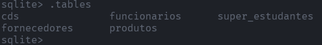

# Lista 02

- 01 - Altere o nome da tabela caixa para dinheiro.
    
    ```sql
    ALTER TABLE caixa RENAME TO dinheiro;
    ```
    
- 02 - Exclua a tabela dinheiro.
    
    ```sql
    DROP TABLE dinheiro;
    ```
    
- 03 - Exclua a tabela notas.
    
    ```sql
    DROP TABLE notas;
    ```
    
- 04 - Altere o nome da tabela super_alunos para alunos.
    
    ```sql
    ALTER TABLE super_alunos  RENAME TO alunos ;
    ```
    
- 05 - Não gostei desse nome. Mude de alunos para estudantes.
    
    ```sql
    ALTER TABLE alunos  RENAME TO estudantes ;
    ```
    
- 06 - Ficou feio mesmo assim. Altere o nome de estudantes para super_estudantes.
    
    ```sql
    ALTER TABLE estudantes  RENAME TO super_estudantes;
    ```
    
- 07 - Veja se o nome foi alterado usando o comando .tables.
    
    
    
- 08 - Exclua a tabela super_estudantes.
    
    ```sql
    DROP TABLE super_estudantes;
    ```
    
- 09 - Agora crie novamente a tabela alunos usando o mesmo comando que usou no exercício 1.
    
    ```sql
    CREATE TABLE alunos (codigo integer, nome varchar(200), telefone varchar(50), cidade varchar(100));
    ```
    
- 10 - Nós esquecemos que a tabela alunos precisa do campo estado! Precisamos alterar a estrutura da tabela incluindo o campo estado. Para isso iremos usar o comando alter table de novo. Veja como é fácil: `ALTER TABLE ALUNOS ADD ESTADO TEXT;` - Ou seja, nós informamos o nome da tabela e o novo campo junto com seu tipo! Faça isso agora!
    
    ```sql
    ALTER TABLE alunos ADD estado varchar(2);
    ```
    
- 11 - Crie novamente a tabela caixa.
    
    ```sql
    CREATE TABLE caixa (
            codigo integer, data date, descricao varchar(255),
            debito number, credito number
    );
    ```
    
- 12 - Adicione o campo observação do tipo text na tabela caixa.
    
    ```sql
    ALTER TABLE caixa ADD observacao text;
    ```
    
- 13 - Adicione o campo cpf na tabela alunos.
    
    ```sql
    ALTER TABLE alunos ADD cpf text;
    ```
    
- 14 - Veja a estrutura da tabela caixa
    
    
    
- 15 - Adicione o campo saldo na tabela caixa.
    
    ```sql
    ALTER TABLE caixa ADD saldo number;
    ```
    
- 16 - Adicione o campo rg na tabela alunos.
    
    ```sql
    ALTER TABLE alunos ADD rg text;
    ```
    
- 17 - Veja a estrutura da tabela alunos.
    
    
    
- 18 - Altere o nome da tabela caixa para muito_dinheiro
    
    ```sql
    ALTER TABLE caixa RENAME TO muito_dinheiro;
    ```
    
- 19 - Acrescente o campo cliente na tabela muito_dinheiro.
    
    ```sql
    ALTER TABLE muito_dinheiro ADD cliente text;
    ```
    
- 20 - Adicione o campo fornecedor na tabela muito_dinheiro
    
    ```sql
    ALTER TABLE muito_dinheiro ADD fornecedor text;
    ```
    
- 21 - Mude o nome da tabela muito_dinheiro para caixa
    
    ```sql
    ALTER TABLE muito_dinheiro RENAME TO caixa;
    ```
    
- 22 - Saia do sqlite.
    
    
    
- 23 - Abra novamente o banco de dados lista1 no sqlite.
    
    
    
- 24 - Veja a lista das tabelas existentes.
    
    
    
- 25 - Exclua a tabela caixa
    
    ```sql
    DROP TABLE caixa ;
    ```
    
- 26 - Exclua a tabela alunos
    
    ```sql
    DROP TABLE alunos;
    ```
    
- 27 - Insira o campo gravadora do tipo TEXT na tabela CDs
    
    ```sql
    ALTER TABLE cds ADD gravadora text;
    ```
    
- 28 - Mude o nome da tabela CDs para MeusCDs
    
    ```sql
    ALTER TABLE cds RENAME TO meus_cds;
    ```
    
- 29 - Mude o nome da tabela MeusCDs para NossosCDs
    
    ```sql
    ALTER TABLE meus_cds RENAME TO nossos_cds;
    ```
    
- 30 - Veja a estrutura da tabela NossosCDs
    
    
