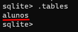

# Lista 03

- 01 - Leia do primeiro ao último exercício antes de começar a resolver.
    
    OK
    
- 02 - Execute o sqlite criando um banco de dados de nome lista3.sqlite.
    
    ```powershell
    ➜ sqlite3.exe "C:\Users\lcorte\OneDrive - Capgemini\Documents\Curso - SQL\Atividades\lista_03.sqlite"
    ```
    
- 03 - Crie uma tabela com o nome de alunos. Deverá conter o campo código (inteiro), nome, telefone e cidade (texto). Vou te ajudar nessa: CREATE TABLE alunos (codigo int, nome text, telefone text, cidade text);
    
    ```sql
    CREATE TABLE alunos (codigo int, nome text, telefone text, cidade text);
    ```
    
- 04 - Use o comando .tables para verificar se a tabela foi criada
    
    
    
- 05 - Crie a tabela funcionários contendo os campos código, nome, endereço, telefone, cidade, estado, cep, rg, cpf e salário. Coloque os tipos de dados necessários.
    
    ```sql
    CREATE TABLE funcionarios (
    	codigo INTEGER,
    	nome VARCHAR(200),
    	endereco VARCHAR(255),
    	telefone VARCHAR(20),
    	cidade VARCHAR(100),
    	estado VARCHAR(2),
    	cep VARCHAR(15),
    	rg VARCHAR(15),
    	cpf VARCHAR(15),
    	salario NUMBER
    );
    ```
    
- 06 - Saia do sqlite com o comando .exit.
    
    
    
- 07 - Abra novamente no sqlite o banco lista3.sqlite.
    
    ```powershell
    ➜ sqlite3.exe "C:\Users\lcorte\OneDrive - Capgemini\Documents\Curso - SQL\curso_sql\atividades\lista_03\lista_03.sqlite"
    ```
    
- 08 - Verifique se as tabelas ainda existem com o comando .tables
    
    
    
- 09 - Agora iremos trabalhar com o comando insert para inserir um novo registro ao banco de dados. Apenas para você lembrar o funcionamento dele iremos inserir um registro na tabela alunos: insert into alunos (código, nome, telefone, cidade) values (1,’Ana’,’9999-9999’,’Ituiutaba’); - Faça esse comando agora.
    
    ```sql
    INSERT INTO alunos (
    	codigo, nome, telefone, cidade
    ) 
    VALUES (
    	1,"Ana","9999-9999","Ituiutaba"
    );
    ```
    
- 10 - Precisamos agora verificar se o registro foi inserido corretamente. Então precisamos selecionar todos os dados da tabela alunos. Use o comando select desse jeito: select * from alunos; (lembre-se que o * aqui nesse caso significa todos os campos, ou seja, irá mostrar nome, endereço, código, etc).
    
    
    
- 11 - Insira um novo registro na tabela alunos com os seus dados.
    
    ```sql
    INSERT INTO alunos (
    	codigo, nome, telefone, cidade
    ) 
    VALUES (
    	1,"Lucas","9999-8888","Junqueirópolis"
    );
    ```
    
- 12 - Selecione os registros da tabela alunos e veja se o registro foi inserido.
    
    
    
- 13 - Ligue os cabeçalhos usando o comando .headers on
    
    
    
- 14 - Selecione novamente para verificar se o cabeçalho foi mostrado corretamente.
    
    
    
- 15 - Insira na tabela alunos o aluno José Buscapé.
    
    ```sql
    INSERT INTO alunos (
    	codigo, nome, telefone, cidade
    ) 
    VALUES (
    	3,"José Buscapé","9999-8888","Junqueirópolis"
    );
    ```
    
- 16 - Selecione o conteúdo da tabela e veja se foi inserido corretamente.
    
    
    
- 17 - Agora você vai aprender um novo recurso do comando select. Você pode escolher os CAMPOS que deseja que sejam exibidos. Por exemplo, se eu quiser exibir somente o código e o nome devo usar o comando assim: select codigo,nome from alunos; - Faça isso agora!
    
    ```sql
    SELECT codigo, nome FROM alunos;
    ```
    
    
    
- 18 - Selecione somente o nome e telefone dos alunos.
    
    ```sql
    SELECT nome, telefone FROM alunos;
    ```
    
    
    
- 19 - Selecione o nome e a cidade dos alunos
    
    ```sql
    SELECT nome, cidade FROM alunos;
    ```
    
    
    
- 20 - Selecione somente o código e o telefone dos alunos
    
    ```sql
    SELECT codigo, cidade FROM alunos;
    ```
    
    | codigo | cidade |
    | --- | --- |
    | 1 | Ituiutaba |
    | 2 | Junqueirópolis |
    | 3 | Junqueirópolis |
- 21 - Insira 4 novos alunos;
    
    ```sql
    INSERT INTO alunos (
    	codigo, nome, telefone, cidade
    ) 
    VALUES (
    	4,"José Alexandre","8888-8888","Dracena"
    );
    INSERT INTO alunos (
    	codigo, nome, telefone, cidade
    ) 
    VALUES (
    	5,"Felipe José","7777-8888","Dracena"
    );
    INSERT INTO alunos (
    	codigo, nome, telefone, cidade
    ) 
    VALUES (
    	6,"Ana Clara","8888-7777","Irapuru"
    );
    INSERT INTO alunos (
    	codigo, nome, telefone, cidade
    ) 
    VALUES (
    	7,"Andressa Karino","6666-8888","Junqueirópolis"
    );
    ```
    
    | codigo | nome | telefone | cidade |
    | --- | --- | --- | --- |
    | 1 | Ana | 9999-9999 | Ituiutaba |
    | 2 | Lucas | 9999-8888 | Junqueirópolis |
    | 3 | José Buscapé | 9999-8888 | Junqueirópolis |
    | 4 | José Alexandre | 8888-8888 | Dracena |
    | 5 | Felipe José | 7777-8888 | Dracena |
    | 6 | Ana Clara | 8888-7777 | Irapuru |
    | 7 | Andressa Karino | 6666-8888 | Junqueirópolis |
- 22 - Selecione todos os campos da tabela alunos
    
    ```sql
    SELECT * FROM alunos;
    ```
    
    | codigo | nome | telefone | cidade |
    | --- | --- | --- | --- |
    | 1 | Ana | 9999-9999 | Ituiutaba |
    | 2 | Lucas | 9999-8888 | Junqueirópolis |
    | 3 | José Buscapé | 9999-8888 | Junqueirópolis |
    | 4 | José Alexandre | 8888-8888 | Dracena |
    | 5 | Felipe José | 7777-8888 | Dracena |
    | 6 | Ana Clara | 8888-7777 | Irapuru |
    | 7 | Andressa Karino | 6666-8888 | Junqueirópolis |
- 23 - Selecione da tabela alunos os seguintes campos (nessa ordem): cidade, código, nome. Veja que você pode exibir os dados na ordem que quiser.
    
    ```sql
    SELECT cidade, codigo, nome FROM alunos;
    ```
    
    | cidade | codigo | nome |
    | --- | --- | --- |
    | Ituiutaba | 1 | Ana |
    | Junqueirópolis | 2 | Lucas |
    | Junqueirópolis | 3 | José Buscapé |
    | Dracena | 4 | José Alexandre |
    | Dracena | 5 | Felipe José |
    | Irapuru | 6 | Ana Clara |
    | Junqueirópolis | 7 | Andressa Karino |
- 24 - Insira mais um alunos na tabela alunos.
    
    ```sql
    INSERT INTO alunos (
    	codigo, nome, telefone, cidade
    ) 
    VALUES (
    	8,"Leonardo","6666-5555","Junqueirópolis"
    );
    ```
    
    | codigo | nome | telefone | cidade |
    | --- | --- | --- | --- |
    | 1 | Ana | 9999-9999 | Ituiutaba |
    | 2 | Lucas | 9999-8888 | Junqueirópolis |
    | 3 | José Buscapé | 9999-8888 | Junqueirópolis |
    | 4 | José Alexandre | 8888-8888 | Dracena |
    | 5 | Felipe José | 7777-8888 | Dracena |
    | 6 | Ana Clara | 8888-7777 | Irapuru |
    | 7 | Andressa Karino | 6666-8888 | Junqueirópolis |
    | 8 | Leonardo | 6666-5555 | Junqueirópolis |
- 25 - Saia do sqlite, feche o terminal e abra novamente.
    
    ```powershell
    sqlite> .exit
    curso_sql on main ↑2  ~1 |  +2 ~1
    ➜ sqlite3.exe "C:\Users\lcorte\OneDrive - Capgemini\Documents\Curso - SQL\curso_sql\atividades\lista_03\lista_03.sqlite"
    SQLite version 3.40.1 2022-12-28 14:03:47
    Enter ".help" for usage hints.
    sqlite>
    ```
    
- 26 - Selecione os dados da tabela a alunos e veja se ainda existem.
    
    ```powershell
    sqlite> SELECT * FROM alunos;
    1|Ana|9999-9999|Ituiutaba
    2|Lucas|9999-8888|Junqueir�polis
    3|Jos� Buscap�|9999-8888|Junqueir�polis
    4|Jos� Alexandre|8888-8888|Dracena
    5|Felipe Jos�|7777-8888|Dracena
    6|Ana Clara|8888-7777|Irapuru
    7|Andressa Karino|6666-8888|Junqueir�polis
    8|Leonardo|6666-5555|Junqueir�polis
    ```
    
- 27 - Adicione 1 novo funcionário. Lembre-se que é necessário usar aspas para campos TEXTO. Campos numéricos não podem ter aspas. Se o salário tiver centavos, lembre-se que deve separar os centavos com um (.) (ponto) pois a vírgula é usada para separar os valores a serem inseridos.
    
    ```sql
    INSERT INTO funcionarios (
    	codigo, nome, endereco, telefone, cidade, estado, cep, rg, cpf, salario
    )
    VALUES(
    	1, 'Lucas S. Corte', 'Rua Porto Alegre, 1660', '99999-9898', 'Junqueirópolis', 'São Paulo', '17.890-000', '44.444.444-44', '555.555.555-55', 2345.67
    );
    ```
    
- 28 - Selecione os dados da tabela funcionários e veja se foi inserido corretamente.
    
    ```sql
    SELECT * FROM funcionarios;
    ```
    
    | codigo | nome | endereco | telefone | cidade | estado | cep | rg | cpf | salario |
    | --- | --- | --- | --- | --- | --- | --- | --- | --- | --- |
    | 1 | Lucas S. Corte | Rua Porto Alegre, 1660 | 99999-9898 | Junqueirópolis | São Paulo | 17.890-000 | 44.444.444-44 | 555.555.555-55 | 2345.67 |
- 29 - Cadastre 3 funcionários. Use código na sequência. (1,2,3,4,5 etc).
    
    ```sql
    INSERT INTO funcionarios (
    	codigo, nome, endereco, telefone, cidade, estado, cep, rg, cpf, salario
    )
    VALUES(
    	2, 'Andressa K. Mendes', 'Av Marconi, 133', '99999-8989', 'Junqueirópolis', 'São Paulo', '17.890-000', '55.555.555-55', '444.444.444-44', 1234.56
    );
    
    INSERT INTO funcionarios (
    	codigo, nome, endereco, telefone, cidade, estado, cep, rg, cpf, salario
    )
    VALUES(
    	3, 'Leonardo S. Silva', 'Rua Victor Junqueira, 555', '99999-7878', 'Junqueirópolis', 'São Paulo', '17.890-000', '66.664.664-66', '777.777.777-77', 1324.65
    );
    
    INSERT INTO funcionarios (
    	codigo, nome, endereco, telefone, cidade, estado, cep, rg, cpf, salario
    )
    VALUES(
    	4, 'Luiz Antonio C. Santos', 'Rua Porto Alegre, 1660', '99999-6969', 'Junqueirópolis', 'São Paulo', '17.890-000', '77.774.774-77', '222.222.222-11', 1435.62
    );
    ```
    
    | codigo | nome | endereco | telefone | cidade | estado | cep | rg | cpf | salario |
    | --- | --- | --- | --- | --- | --- | --- | --- | --- | --- |
    | 1 | Lucas S. Corte | Rua Porto Alegre, 1660 | 99999-9898 | Junqueirópolis | São Paulo | 17.890-000 | 44.444.444-44 | 555.555.555-55 | 2345.67 |
    | 2 | Andressa K. Mendes | Av Marconi, 133 | 99999-8989 | Junqueirópolis | São Paulo | 17.890-000 | 55.555.555-55 | 444.444.444-44 | 1234.56 |
    | 3 | Leonardo S. Silva | Rua Victor Junqueira, 555 | 99999-7878 | Junqueirópolis | São Paulo | 17.890-000 | 66.664.664-66 | 777.777.777-77 | 1324.65 |
    | 4 | Luiz Antonio C. Santos | Av Junqueira, 098 | 99999-6969 | Junqueirópolis | São Paulo | 17.890-000 | 77.774.774-77 | 222.222.222-11 | 1435.62 |
- 30 - Selecione somente o código e nome dos funcionários.
    
    ```sql
    SELECT codigo, nome FROM funcionarios;
    ```
    
    | codigo | nome |
    | --- | --- |
    | 1 | Lucas S. Corte |
    | 2 | Andressa K. Mendes |
    | 3 | Leonardo S. Silva |
    | 4 | Luiz Antonio C. Santos |